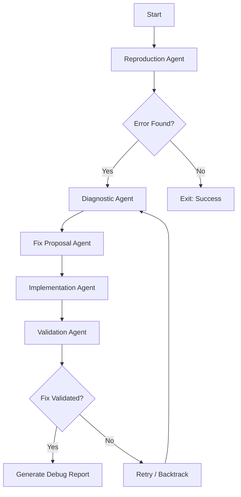

# Self-Healing Debugging Swarm

The Self-Healing Debugging Swarm is a multi-agent system designed to autonomously reproduce, diagnose, fix, and validate code issues.

## 5-Agent Architecture

1.  **Reproduction Agent:** Executes the target command/script and captures the exact exit code, stdout, and stderr.
2.  **Diagnostic Agent:** Parses stack traces and log outputs. Uses `grep_search` and `read_file` to locate the root cause in the source code.
3.  **Fix Proposal Agent:** Uses the diagnosis to generate 2-3 potential fixes with detailed pros/cons for each.
4.  **Implementation Agent:** Applies the selected fix using atomic `replace_file_content` or `multi_replace_file_content` calls.
5.  **Validation Agent:** Re-runs the reproduction script and any existing test suites to confirm the fix and check for regressions.

## Orchestration Flow



## Features
- **Automatic Retries:** If an edit fails or validation fails, the swarm can try an alternative fix or re-diagnose.
- **Atomic Changes:** Only the minimal necessary code is changed to reduce regression risk.
- **Comprehensive Reporting:** Produces a `debugging_report.json` with details of every step.

## Usage Example
```bash
python3 debug_swarm.py --cmd "uv run main.py --agent random --game ls20"
```
